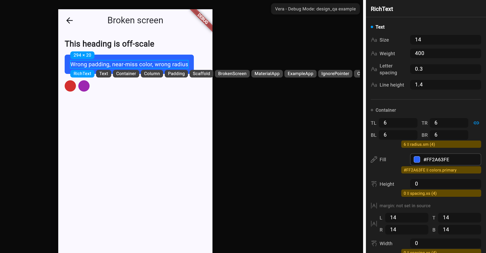
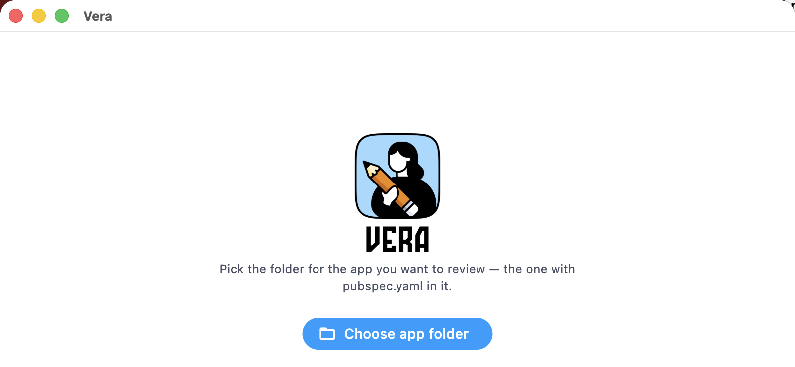
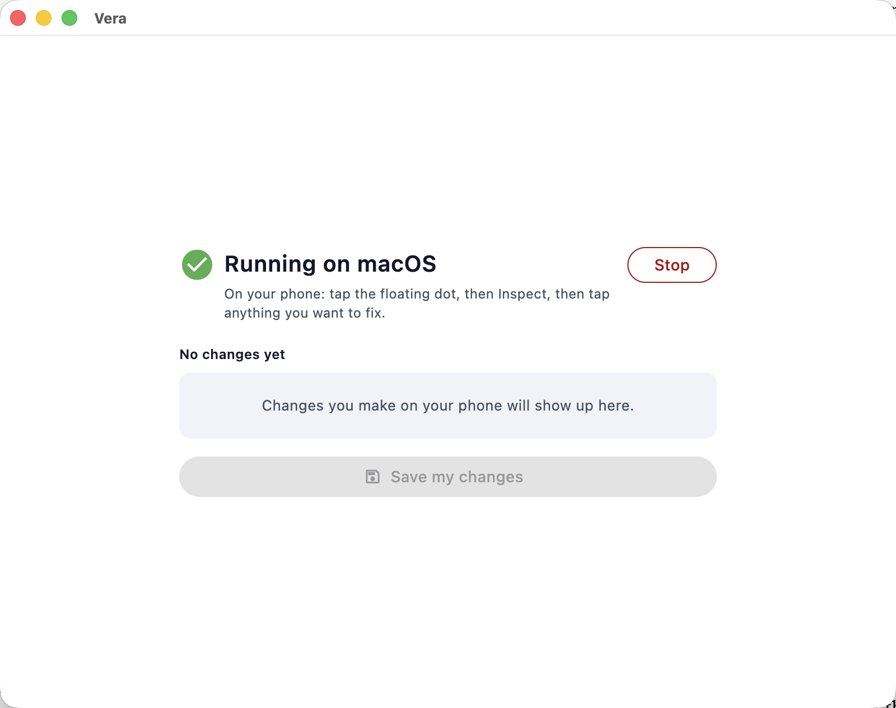

# design_qa

A debug-only visual overlay that lets a designer correct design fidelity
errors directly on a running Flutter app, then export the corrections as
source patches. Works on any Flutter project, no app-code changes beyond
one wrapper call.

## Screenshots

Tap a widget in inspect mode and get a live, editable property panel bound
to its actual `RenderObject` - values that drift from your design tokens are
flagged inline (the gold rows below):



**Vera**, the companion macOS app, automates setup and drives a device so you
don't have to touch a terminal:

<p>
  
  
</p>

## Install

```bash
flutter pub add --dev design_qa
dart run design_qa:init
flutter run --track-widget-creation
```

**`--track-widget-creation` is not optional.** Without it, design_qa can't
map a tapped widget back to a line in your source, and inspect mode stays
disabled with a banner telling you so.

`dart run design_qa:init`:
- Finds your `main()`, shows you a diff, and asks before wrapping your root
  widget in `DesignQA.wrap(...)`.
- Scans your project for an existing token source (a class of `static
  const` Color/spacing fields) and pre-fills `design_qa.yaml` with what it
  finds - or an empty, commented stub if it finds nothing.
- Auto-discovers named routes from `MaterialApp`/`GoRouter` into
  `design_qa.yaml` so the route jumper works out of the box.
- Registers `design_qa.yaml` as a Flutter asset (needed so it loads on a
  device, not just on desktop).
- Is safe to re-run after you add screens - it only ever appends newly
  found routes, never touches your hand edits.

## Using it

A floating pill appears in debug builds:

- **Inspect** - tap any widget to select it. A highlight box shows its
  size; a breadcrumb underneath lets you walk up to an ancestor if you hit
  the wrong thing.
- **Property panel** - opens when you select something, with editable
  controls for whatever that widget type supports (padding, color, font
  size, alignment, ...). Numeric fields: drag the label to scrub, arrow
  keys for ±1, shift+arrow for ±8, or type a value. Changes apply live, no
  rebuild.
- **Token linting** - a value that doesn't match anything in
  `design_qa.yaml`'s tokens gets a one-tap "16 → spacing.md" fix inline.
- **Routes** - search and jump to any named route from `design_qa.yaml`,
  with mock arguments for screens that need them.
- **Reference overlay** - load a PNG (Figma export), pin it over the app
  with opacity/position/scale. `\` cycles off → 50% opacity → difference
  blend, for pixel-checking against the design.
- **Export** - writes a unified diff + plain-English changelog to
  `design_qa_out/`. Never touches your source directly.

## Exporting from Android

A device or emulator has no access to your machine's filesystem, so
exporting there needs one extra step:

```bash
dart run design_qa:export --vm-service-uri=<uri>
```

Use the URI `flutter run` printed when it started (`A Dart VM Service on
... is available at: ...`). On macOS desktop this isn't needed - the
export button writes directly.

## Zero release impact

`DesignQA.wrap` is a `kDebugMode` branch - in release and profile builds
it returns your widget unmodified and the entire overlay is unreachable
code, which the Dart/AOT compiler removes rather than merely skipping.
[`doc/release_build_proof.md`](doc/release_build_proof.md) measures this
directly: the release binary is byte-for-byte identical with and without
`DesignQA.wrap`.

## Docs

- [`doc/design_qa_yaml_reference.md`](doc/design_qa_yaml_reference.md) -
  every config key and its default.
- [`doc/limitations.md`](doc/limitations.md) - const widgets, third-party
  widgets, generated code, GoRouter, and what to do about each.
- [`example/`](example/) - a working app, plus `broken_screen.dart`, a
  deliberately off-spec screen for trying the fix loop end to end.

## macOS notes

`file_picker` and writing `design_qa_out/` both need normal file access.
If you've enabled the macOS App Sandbox entitlement for your app, add
read/write file access (`com.apple.security.files.user-selected.read-write`)
in `macos/Runner/DebugProfile.entitlements`, or disable sandboxing for
local debug runs.
